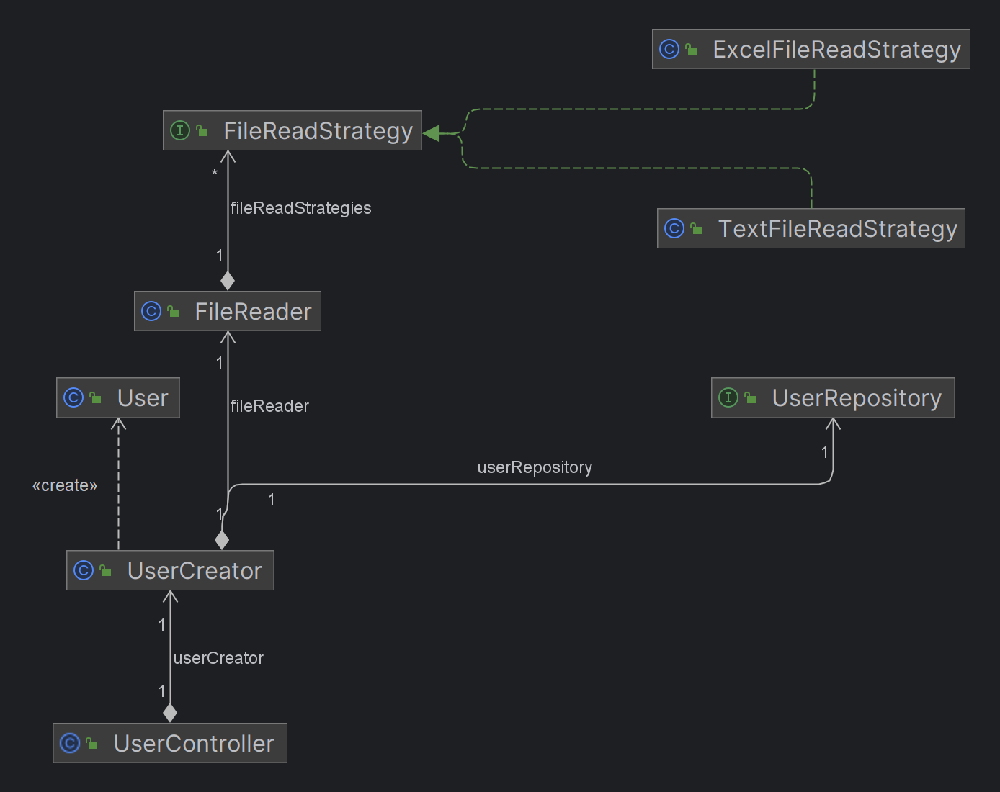

# Strategy Pattern

## Overview

> Strategy is a behavioral design pattern that lets you define a family of algorithms, put each of them into a separate class, and make their objects interchangeable.

## Problem description

We need to develop an application that allows the information of several users 
to be saved in a database from a file. Currently, this file can be in .txt or .xlsx 
format, but in the future it may be required to accept other formats, such as JSON.

## Implementation Details

The Strategy Pattern is used here to abstract the process of 
reading and parsing files, allowing the same code to work with 
different file formats without needing to modify the controller 
or service code.

Additionally, with Spring Boot dependency injection, it automatically 
captures every implementation of the FileReadStrategy interface 
(as long as it is annotated with @Component/@Service).

## Structure

- **controller**: Contains classes for handling user requests.
- **service**: Classes where the core business logic is implemented.
- **repository**: Includes data access operations.
- **entity**: Contains classes representing various data models.
- **strategy**: Houses the various strategy implementations.

## Benefits of Using the Strategy Pattern
1. **Flexibility**: Makes it easy to add new file formats by 
simply adding new strategies, without altering existing code.
2. **Maintainability**: Separates concerns, making code easier 
to maintain and test.
3. **Reuse**: Individual strategies can be reused in different 
parts of the application if necessary.